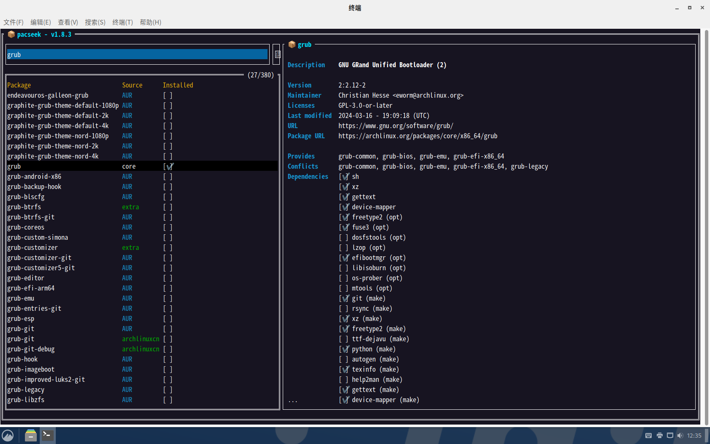

# ArchLinux初始配置以及常用软件安装

## 更换 Arch Linux 镜像源

修改 `/etc/pacman.d/mirrorlist` 文件, 添加国内镜像

```bash
# China
Server = https://mirrors.xjtu.edu.cn/archlinux/$repo/os/$arch
Server = https://mirrors.wsyu.edu.cn/archlinux/$repo/os/$arch
Server = https://mirrors.ustc.edu.cn/archlinux/$repo/os/$arch
Server = https://mirrors.tuna.tsinghua.edu.cn/archlinux/$repo/os/$arch
Server = https://mirrors.sjtug.sjtu.edu.cn/archlinux/$repo/os/$arch
Server = https://mirrors.shanghaitech.edu.cn/archlinux/$repo/os/$arch
Server = https://mirrors.qvq.net.cn/archlinux/$repo/os/$arch
Server = https://mirrors.qlu.edu.cn/archlinux/$repo/os/$arch
Server = https://mirrors.nju.edu.cn/archlinux/$repo/os/$arch
Server = https://mirrors.neusoft.edu.cn/archlinux/$repo/os/$arch
Server = https://mirrors.jxust.edu.cn/archlinux/$repo/os/$arch
Server = https://mirrors.jlu.edu.cn/archlinux/$repo/os/$arch
Server = https://mirrors.cqu.edu.cn/archlinux/$repo/os/$arch
Server = https://mirrors.bfsu.edu.cn/archlinux/$repo/os/$arch
Server = https://mirrors.aliyun.com/archlinux/$repo/os/$arch
Server = https://mirror.nyist.edu.cn/archlinux/$repo/os/$arch
```

## 创建用户目录
用户目录指位于 `$HOME` 下的一系列常用目录, 例如 `Documents`, `Downloads`, `Music`, 以及 `Desktop`. 用户目录会在文件管理器中显示为不同的图标, 且被多种应用程序所参照. 可以使用 `xdg-user-dirs包` 自动生成这些目录. 详细信息参考[freedesktop.org](https://www.freedesktop.org/wiki/Software/xdg-user-dirs/)

```bash
# 安装 xdg-user-dirs
pacman -S xdg-user-dirs

# 创建经本地化的用户目录
xdg-user-dirs-update
# 如果不想创建中文目录(桌面/下载/音乐)可以用以下指令创建英文目录(Desktop/Downloads/Music)
# 如果想创建其他语言的本地化用户目录, 修改LC_ALL参数即可. 如：LC_ALL=en_GB
LC_ALL=C xdg-user-dirs-update --force
```

`xdg-user-dirs-update`指令运行后还会在`~/.config/`目录下自动创建`user-dirs.dirs`和`user-dirs.locale`文件, 如果想修改用户目录对应的目录的名称, 则修改`user-dirs.dirs`文件中的内容即可

```bash
XDG_DESKTOP_DIR="$HOME/Desktop"
XDG_DOWNLOAD_DIR="$HOME/Downloads"
XDG_TEMPLATES_DIR="$HOME/Templates"
XDG_PUBLICSHARE_DIR="$HOME/Public"
XDG_DOCUMENTS_DIR="$HOME/Documents"
XDG_MUSIC_DIR="$HOME/Music"
XDG_PICTURES_DIR="$HOME/Pictures"
XDG_VIDEOS_DIR="$HOME/Videos"
```

## 添加 Arch Linux CN 软件仓库
Arch Linux 中文社区仓库 是由 Arch Linux 中文社区驱动的非官方用户仓库。包含中文用户常用软件、工具、字体/美化包等。

完整的包信息列表（包名称/架构/维护者/状态）请[点击这里](https://github.com/archlinuxcn/repo)查看。

官方仓库地址：https://repo.archlinuxcn.org, 这里我使用清华大学的镜像站, 更多镜像站地址可以在ArchLinuxCN的[Github项目](https://github.com/archlinuxcn/mirrorlist-repo)中查看

在 `/etc/pacman.conf` 文件末尾添加以下两行：

```bash
[archlinuxcn]
Server = https://mirrors.tuna.tsinghua.edu.cn/archlinuxcn/$arch
```

在本地信任 farseerfc 的 GPG key：

```bash
sudo pacman-key --lsign-key "farseerfc@archlinux.org"
```

之后通过以下命令安装 archlinuxcn-keyring 包导入 GPG key。

```bash
sudo pacman -Sy archlinuxcn-keyring
```

## 安装Aur助手
推荐`paru`和`pacseek`, pacseek方便查找软件. 在终端中输入以下指令
```bash
# 安装paru
sudo pacman -S --needed base-devel git
git clone https://aur.archlinux.org/paru-bin.git
cd paru-bin
makepkg -si

# 安装pacseek
paru -S pacseek

# 修改pacseek配置, InstallCommand修改为"paru -S", UninstallCommand修改为"paru -Rsn", SysUpgradeCommand修改为"paru"
nano ~/.config/pacseek/config.json
```



## 安装输入法
安装`fcitx5-im`和`fcitx5-rime`, 如果需要双拼输入则再安装`rime-ice-double-pinyin-flypy-git`

之后编辑 `/etc/environment` 并添加以下几行, 然后重新登录
```bash
GTK_IM_MODULE=fcitx
QT_IM_MODULE=fcitx
XMODIFIERS=@im=fcitx
SDL_IM_MODULE=fcitx
INPUT_METHOD=fcitx
GLFW_IM_MODULE=ibus
```

### 配置Rime
Rime配置文件目录在`~/.local/share/fcitx5/rime`, 新建`default.custom.yaml`文件以对默认设置进行修改
```yaml
patch:
  # 输入方案列表
  schema_list:
    # 小鹤双拼
    - schema: double_pinyin_flypy
    # 以下是rime的预设方案
    # 朙月拼音
    # - schema: luna_pinyin
    # - schema: luna_pinyin_simp
    # - schema: luna_pinyin_fluency
    # 注音符號輸入
    # - schema: bopomofo
    # - schema: bopomofo_tw
    # 倉頡輸入法
    # - schema: cangjie5
    # 五筆畫輸入法
    # - schema: stroke
    # 地球拼音
    # - schema: terra_pinyin
  menu:
    # 候选页大小
    page_size: 7
```

如果要修改输入方案的默认配置, 则在`~/.local/share/fcitx5/rime`下创建`<方案名称>.custom.yaml`文件, 方案配置文件保存在`/usr/share/rime-data`目录, 找到`<方案名称>.schema.yaml`将里面要修改的选项复制到`<方案名称>.custom.yaml`文件中并进行修改
```yaml
patch:
  speller:
    algebra:
      - erase/^xx$/
      - derive/^([jqxy])u$/$1v/
      # 添加模糊音
      - derive/([aei])n$/$1ng/  # an => ang, en => eng, in => ing
      - derive/([aei])ng$/$1n/  # ang => an, eng => en, ing => in
      # 下面这些是输入方案预设配置, 不需要的可以删掉
      - derive/^([aoe])([ioun])$/$1$1$2/
      - xform/^([aoe])(ng)?$/$1$1$2/
      - xform/iu$/Ⓠ/
      - xform/(.)ei$/$1Ⓦ/
      - xform/uan$/Ⓡ/
      - xform/[uv]e$/Ⓣ/
      - xform/un$/Ⓨ/
      - xform/^sh/Ⓤ/
      - xform/^ch/Ⓘ/
      - xform/^zh/Ⓥ/
      - xform/uo$/Ⓞ/
      - xform/ie$/Ⓟ/
      - xform/(.)i?ong$/$1Ⓢ/
      - xform/ing$|uai$/Ⓚ/
      - xform/(.)ai$/$1Ⓓ/
      - xform/(.)en$/$1Ⓕ/
      - xform/(.)eng$/$1Ⓖ/
      - xform/[iu]ang$/Ⓛ/
      - xform/(.)ang$/$1Ⓗ/
      - xform/ian$/Ⓜ/
      - xform/(.)an$/$1Ⓙ/
      - xform/(.)ou$/$1Ⓩ/
      - xform/[iu]a$/Ⓧ/
      - xform/iao$/Ⓝ/
      - xform/(.)ao$/$1Ⓒ/
      - xform/ui$/Ⓥ/
      - xform/in$/Ⓑ/
      - xlit/ⓆⓌⓇⓉⓎⓊⒾⓄⓅⓈⒹⒻⒼⒽⒿⓀⓁⓏⓍⒸⓋⒷⓃⓂ/qwrtyuiopsdfghjklzxcvbnm/
```
