# Arch Linux 安装手册

首先在[Arch Linux](https://archlinux.org/download)官网下载iso文件，之后使用Rufus等工具将iso文件刻录到U盘中

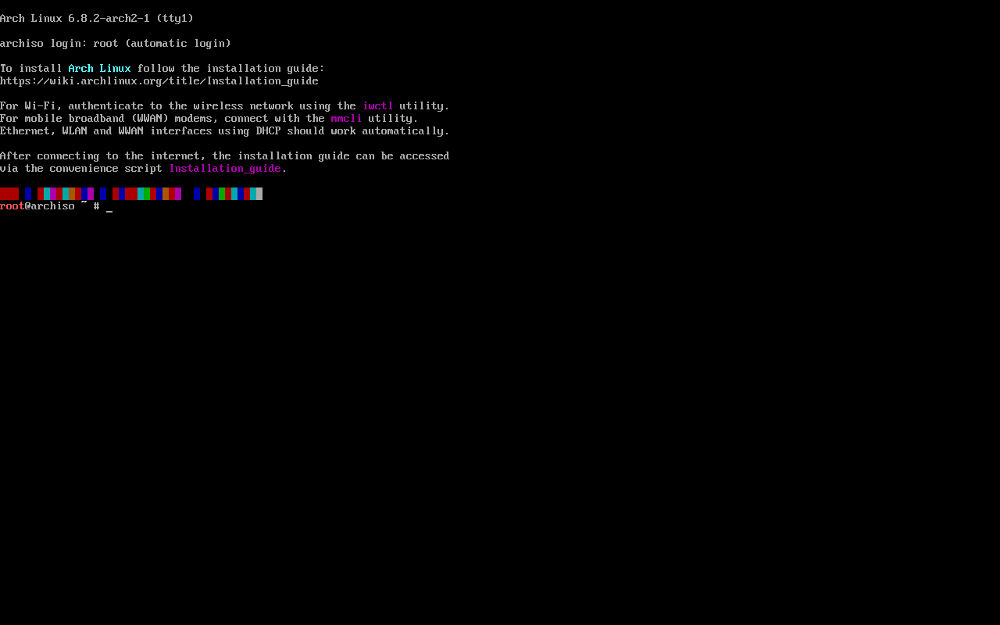

输入`archinstall`进入安装界面

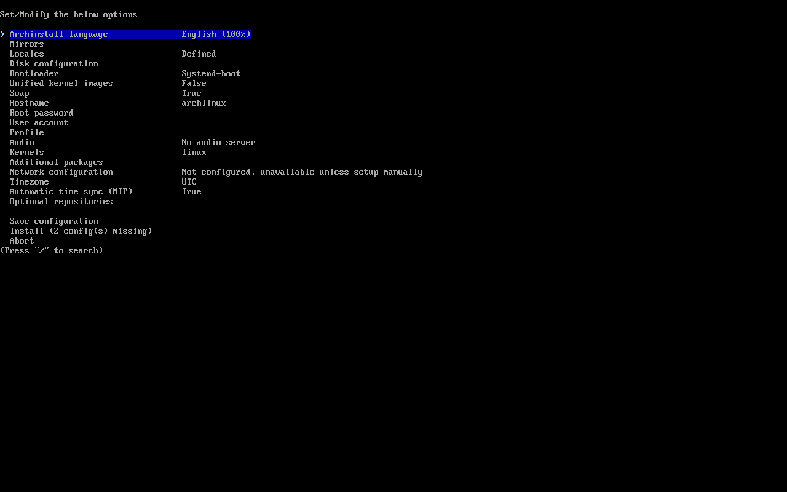

## Mirrors
选择镜像地区

## Locales
`Locale language`如果平时使用tty就选`en_US.UTF-8`, 不要选`zh_CN`, 否则安装好后tty里面会出现方块, 但是如果要安装桌面或者不使用tty那这里就可以选`zh_CN.UTF-8`, 这里我选`zh_CN.UTF-8`因为之后要安装桌面.

`Locale encoding`选`UTF-8`, 避免编码问题

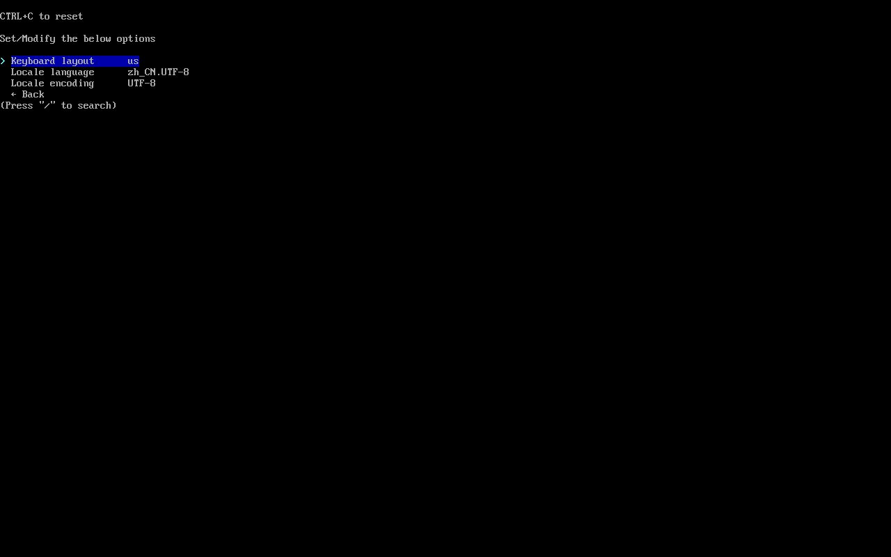

## Disk Configuration
第一个选项是自动分区, 第二个是手动分区, 第三个是加载分区配置文件. 这里我选自动分区，格式选`btrfs`, 这样他就会自动帮我分好带5个子卷的btrfs分区


如果有需要调整的地方可以在这里修改

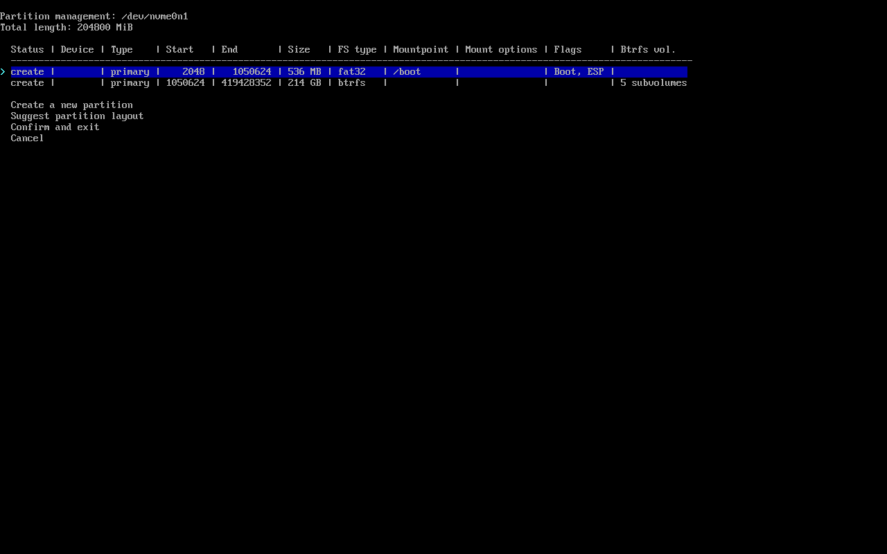

## Disk Encryption
硬盘加密, 根据自己需要设置就行

## Boot Loader
选自己喜欢的就行, 我用Grub

## Swap
按个人喜好决定要不要启用, 这里提供的是`swap on zram`, 如果想使用传统的swap则需要自己手动分配

## Hostname
主机名称, 填你自己喜欢的就行, 比如`Ilirus-PC`

## Root Password
随便填, 不要留空就行, 不然用不了root

## User Account
按个人需要创建用户

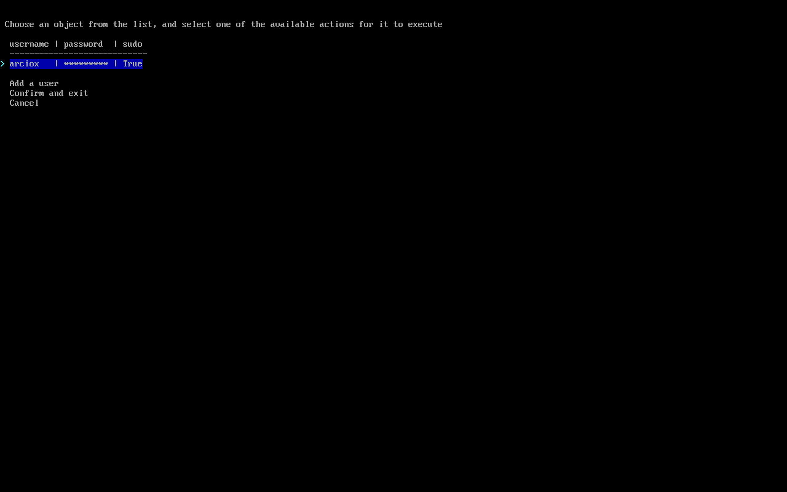

## Profile
可以在这里选择想安装的桌面, 也可以选 Minimal 之后自己手动安装

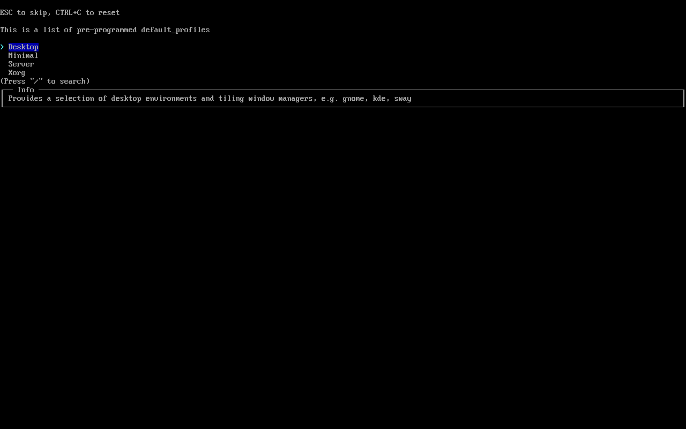
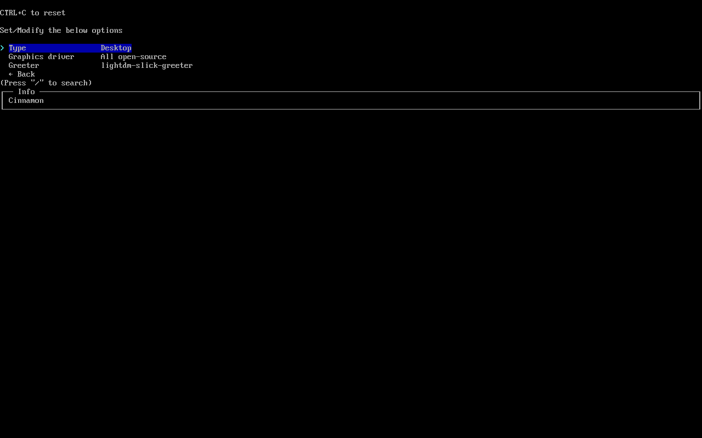

## Audio
不知道干嘛的, 这里选No安装好后也有声音

## Kernels
Linux内核, 一般默认选`linux`即可, 如果经常长期不用电脑可以选`linux-lts`, 如果要用`Waydriod`运行安卓App可以选`linux-zen`. 可以多选, 按空格选择, 按回车确认

## Additional Packages
安装linux时要一起安装的组件, 建议安装`noto-fonts-cjk`中文字体、`fcitx5-im`输入法组件以及对应CPU的微码, Intel的CPU安装`intel-ucode`, AMD的CPU安装`amd-ucode`, 我这里用的是虚拟机所以就不安装了

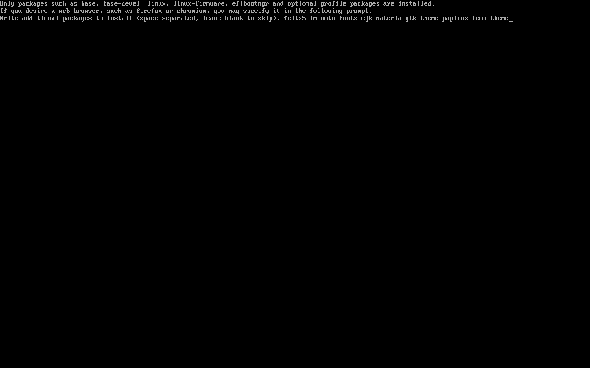

## Network Configuration
第一个是复制liveISO中的配置, 第二个是用`NetworkManager`管理, 安装了桌面环境一般选这个, 第三个是手动配置

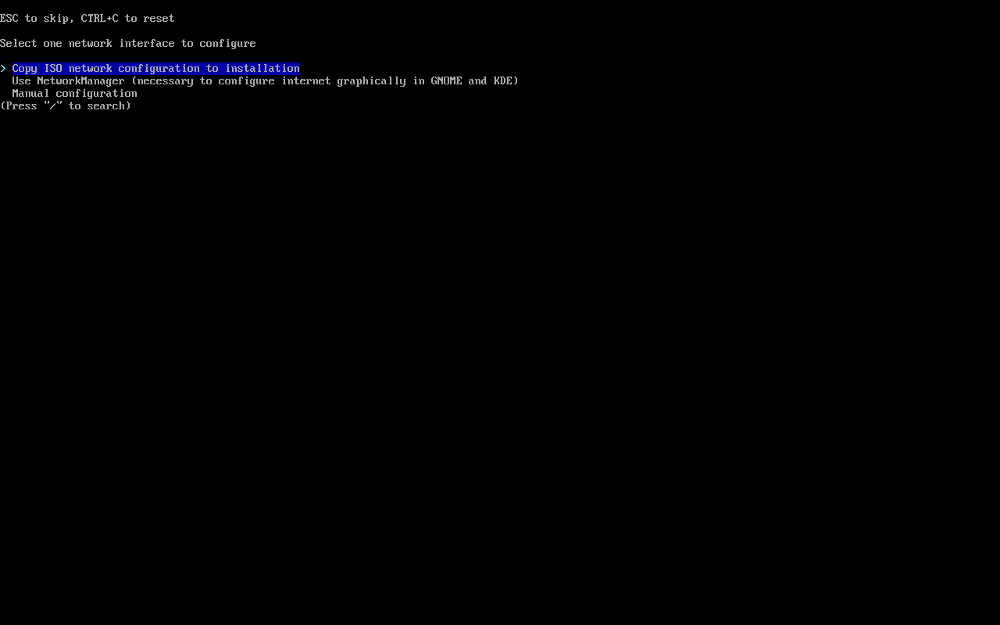

## Timezone
选自己所在的时区即可, 按/可以进行搜索


## Automatic Time Sync
自动校准时间, 默认开启

## Optional Repositories
额外软件库, 要安装32位程序就启用`multilib`, `testing`不建议启用. 可以多选, 按空格选择, 按回车确认


## Save Configuration
保存安装配置到新系统, 可以方便以后安装

## Install
确认无误后选择`Install`选项即可开始安装, 因为需要从网络下载文件所以安装期间请保持网络通畅

安装完成后会询问你是否要进入新安装的系统进行设置, 这里选`yes`或者`no`都行

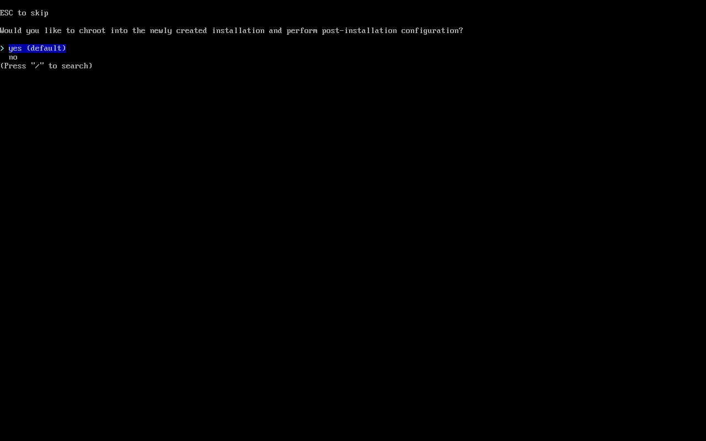

选择`yes`则可以在这里进行一些配置, 如果之前没有在`Additional Packages`选择安装fcitx5, 就可以在这里进行安装.


如果前面语言选择了`en_US`的则可以在这里启用`zh_CN`, 选择了`zh_CN`也建议在这里启用`en_US`作为fallback

输入`nano /etc/locale.gen`, 分别把`en_US.UTF-8 UTF-8`和`zh_CN.UTF-8 UTF-8`前面的注释取消

之后执行`locale-gen`指令重新生成Locale, 之后输入`nano /etc/locale.conf`修改文件内容
```
LANG=zh_CN.UTF-8
LANGUAGE=zh_CN:en_US
```

如果安装了`fcitx5-im`, 则可以在这里配置输入法， 输入`nano /etc/environment`在文件内添加以下几行
```
GTK_IM_MODULE=fcitx
QT_IM_MODULE=fcitx
XMODIFIERS=@im=fcitx
SDL_IM_MODULE=fcitx
INPUT_METHOD=fcitx
GLFW_IM_MODULE=ibus
```


配置完成后输入`exit`退出, 等待系统提示`You may now reboot`时输入reboot重启

重启后进入桌面, 因为什么都没有配置所以这里背景是黑色, 并且因为自带的图标包不完整所以有些图标显示不出来, 建议先更换图标包再进行其他配置

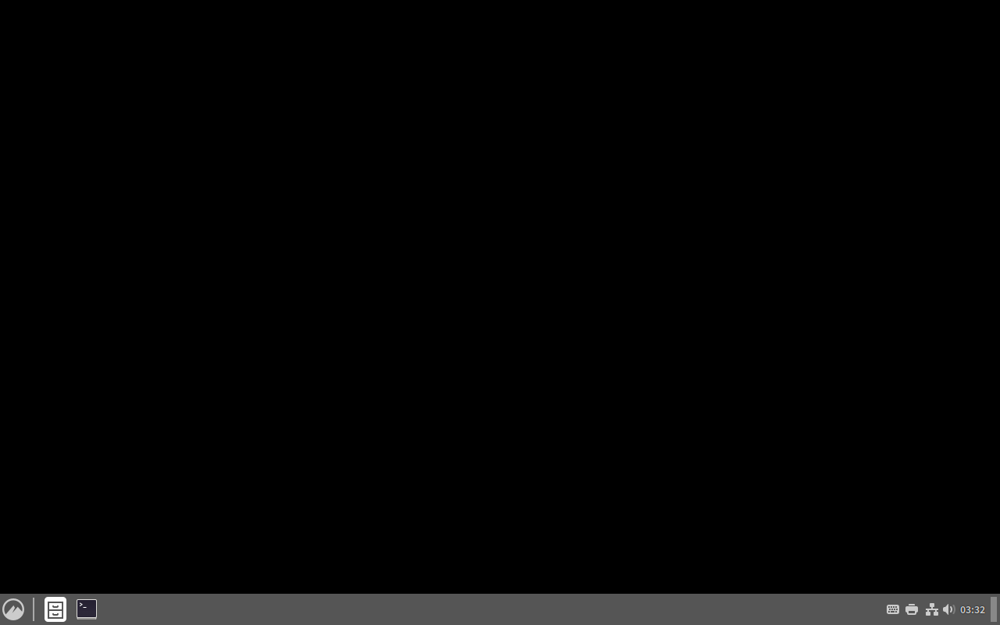

稍微调整后的结果, 主题使用`Materia`, 图标使用`Papirus`

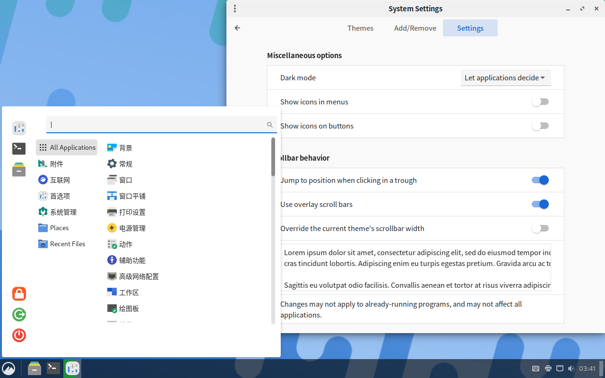
