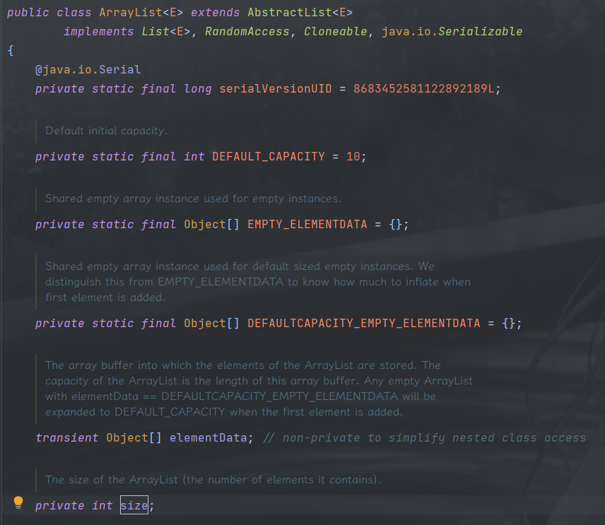
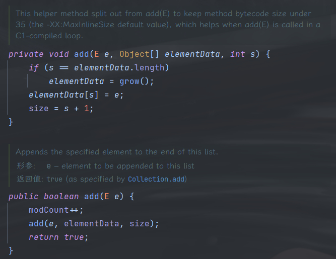
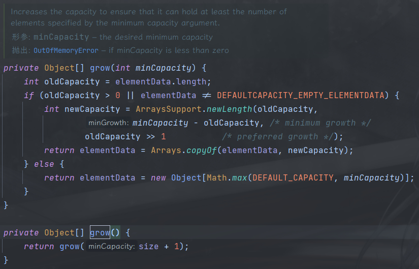

## ArrayList的底层实现
`ArrayList` 底层是基于数组来实现的，而数组是使用一组连续的空间来存储数据类型相同的数据，并且数组的空间大小是固定的。

因为数组的空间大小固定，存储的数据类型也相同，所以我们就可以通过寻址公式类随机访问数组中的任意一个下标的元素。

```java
address[i] = baseAddress + i * dataTypeSize
```

因为 `ArrayList` 基于数组实现，而数组的空间大小是固定的，所以当数组的空间用完了，就需要对 `ArrayList` 底层的数组进行扩容。

当使用 `ArrayList` 默认的构造函数创建对象时，底层的数组实际是被赋值为一个**空数组**，但我们第一次调用往其中添加元素时，才会触发具体扩容逻辑，第一次扩容默认的初始化容量为10，使用了延迟加载的实现方式避免空间浪费。

## ArrayList的扩容逻辑




在调用 `add()` 方法时，会判断 `ArrayList` 中 `elementData` 这个数组的容量是否等于 `ArrayList` 的大小，也就是判断 `elementData` 数组是不是满的，如果等于则说明当前数组空间满了，则调用 `grow()` 方法进行扩容，之后再添加元素到到数组中。



在看看 `grow()` 方法中又调用了一个带参方法 `grow(int minCapacity)` 参数是当前大小+1，那么我们来看下这个带参数的 `grow` 方法。

```java
private Object[] grow(int minCapacity) {
  // 记录容量大小
  int oldCapacity = elementData.length;
  // 判断容量大于0，并且数组不是DEFAULTCAPACITY_EMPTY_ELEMENTDATA
  // DEFAULTCAPACITY_EMPTY_ELEMENTDATA 这个数组是使用ArrayList的无参构造函数时赋值给elementData的
  // 也就是说这个if语句不会处理使用默认的无参构造函数创建的数组
  if (oldCapacity > 0 || elementData != DEFAULTCAPACITY_EMPTY_ELEMENTDATA) {
    // 使用ArraysSupport.newLengt 计算新数组的大小
    // 这里的位运算 oldCapacity>>1 等于 oldCapacity*0.5
    int newCapacity = ArraysSupport.newLength(
      oldCapacity,
      minCapacity - oldCapacity, /* minimum growth */
      oldCapacity >> 1           /* preferred growth */
    );
    // 使用Arrays.copyOf 创建一个新的数组, 大小则为newCapacity的值
    return elementData = Arrays.copyOf(elementData, newCapacity);
  } else {
    return elementData = new Object[Math.max(DEFAULT_CAPACITY, minCapacity)];
  }
}
```

总结一下 `ArrayList` 的扩容规律
1. `ArrayList` 在底层数组容量满了的情况下才会进行扩容，并且通常情况下会扩容为1.5倍。
2. 进行扩容最少会使 `ArrayList` 底层数组的容量增加1。
3. 使用无参构造函数时，创建的 `ArrayList` 容量为0，首次扩容时容量变为 `DEFAULT_CAPACITY`，也就是10，此后再进行扩容时则正常扩容。
4. 使用带容量参数的构造函数且容量参数为0时，首次扩容时容量变为1，此后再进行扩容时则正常扩容。

## LinkedList的底层实现
`LinkedList` 底层是基于**双向链表**实现，其中使用了 head 和 tail 指针分别指向链表头部和尾部的节点，当添加元素时，只需要通过 tail 指针往尾节点后面添加元素即可。

数组需要申请连续的内存块，而链表的实现不需要连续的内存块，链表中通过指针将链表中多个节点连接起来，链表中的每个节点除了存储自身的数据外，还需要申请额外的存储空间存储指向当前节点的前驱节点的指针和指向后继节点的指针。

当我们向链表中添加元素时，只需要将新的数据节点添加到链表尾部即可。因为链表不需要保证内存空间的连续性，所以添加过程中不涉及具体的数据搬移操作。

## ArrayList与LinkedList对比
ArrayList：
- 基于数组。
- 随机访问速度优于 `LinkedList`，可以根据下标以 `O(1)` 时间复杂度对元素进行随机访问。
- 插入与删除元素的速度劣于 `LinkedList`，原因是在进行插入与删除操作时，会涉及到底层数组的数据搬移操作。
- 需要连续的内存块存储数据。

LinkedList：
- 基于双向链表。
- 随机访问速度劣于 `ArrayList`，因为当要访问链表中的某个元素时，只能从头部往后遍历查找。
- 插入与删除元素的速度优于 `ArrayList`，只需要更改前后节点的指针指向即可。
- 需要更多的内存空间来存储的每个节点的前驱节点和后继节点的指针