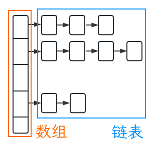

## 实现原理



`HashMap` 是由**数组**与**链表**组成的，又叫**链表散列**。

`HashMap` 初始容量默认为16，如果在创建 `HashMap` 手动指定容量，则会自动将容量调整到大于指定容量且最接近指定容量**2的整数次幂**大小。

当调用 `put()` 方法储存 K/V键值对 时，会首先计算 K 的 hash 值，然后根据数组长度，计算得出对应的数组下标，如果 K 的 hash 值已经存在，且它们两者的 equals 返回 true，则更新键值对的值，如果返回 fasle，则说明发生 **hash碰撞**，jdk1.7之前会将新的键值对插入到链表头部，jdk1.8之后则是插入到链表尾部。

当数组中的元素个数大于 容量*负载因子(默认为0.75) 时，数组会进行**扩容**，扩容后大小变为**2倍**。

如果由于碰撞导致链表大小超过8，并且数组大小大于等于64时，则会将其转换为**红黑树**以提高查询效率，如果由于删除元素导致红黑树节点数量少于6时，则会转换为**链表**。

## HashMap的容量为什么是2的整数次幂

在 `HashMap` 中，存储桶（buckets）的数量等于数组的长度。通过哈希函数将键映射到对应的存储桶，然后在存储桶中查找或存储对应的值。使用 2 的幂次方作为数组的长度，可以通过位运算代替取模运算，提高计算效率。

此外，使用 2 的幂次方作为数组长度还能够更好地分散哈希码的分布，减少哈希冲突的概率。如果数组长度不是 2 的幂次方，那么在计算哈希码与数组长度取模时，低位可能不会被充分利用，可能导致一些位的哈希码无法影响到存储桶的选择，从而增加哈希冲突的可能性。

因此，为了提高散列算法的效率和减少哈希冲突，`HashMap` 选择将长度设置为 2 的幂次方。这样可以通过位运算代替取模运算，提高计算效率，并且更好地分散哈希码的分布，减少哈希冲突的概率。

## HashMap的负载因子为什么默认是0.75

负载因子是 `HashMap` 中用于衡量存储桶利用率的一个参数。在 `HashMap` 中，负载因子表示存储桶中键值对的平均数量与存储桶数组长度的比值。

较低的负载因子意味着存储桶中的键值对数量相对较少，可以更好地分散键的hash，减少多个键映射到同一个存储桶的情况，从而减少哈希冲突的概率。

较高的负载因子意味着更高存储桶利用率。可以用更少的存储桶储存更多的键值对，节省了更多的空间。

使用0.75作为默认负载因子是为了在减少hash碰撞与提高存储桶利用率之间达到一种平衡。

## Hash的计算方法

```java
static final int hash(Object key) {
  int h;
  return (key == null) ? 0 : (h = key.hashCode()) ^ (h >>> 16);
}
```

## 链表何时转为红黑树

`putVal()` 方法中链表转红黑树的判断逻辑

```java
for (int binCount = 0; ; ++binCount) {
  if ((e = p.next) == null) {
    p.next = newNode(hash, key, value, null);
    // 如果链表元素个数大于等于TREEIFY_THRESHOLD (8)
    if (binCount >= TREEIFY_THRESHOLD - 1) // -1 for 1st
      // 执行treeifyBin() 方法
      treeifyBin(tab, hash);
    break;
  }
  if (e.hash == hash &&
    ((k = e.key) == key || (key != null && key.equals(k))))
    break;
  p = e;
}
```

`treeifyBin()`方法中判断是否实际转化为红黑树的逻辑

```java
final void treeifyBin(Node<K,V>[] tab, int hash) {
  int n, index; Node<K,V> e;
  // 如果当前数组长度小于64, 则优先进行数组扩容
  if (tab == null || (n = tab.length) < MIN_TREEIFY_CAPACITY)
    resize();
  else if ((e = tab[index = (n - 1) & hash]) != null) {
    // 数组长度大于64, 才会转化为红黑树
    TreeNode<K,V> hd = null, tl = null;
    do {
      TreeNode<K,V> p = replacementTreeNode(e, null);
      if (tl == null)
        hd = p;
      else {
        p.prev = tl;
        tl.next = p;
      }
      tl = p;
    } while ((e = e.next) != null);
    if ((tab[index] = hd) != null)
      hd.treeify(tab);
  }
}
```
