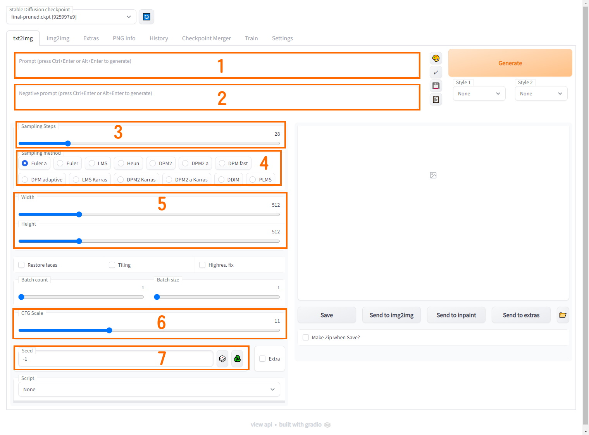

# NovelAI使用指南
　　`NovelAI`是一个图像生成AI，其训练数据来源于`Danboorn`。

## 安装
　　访问NovelAI[官网](https://novelai.net/)

　　或者使用[stable-diffusion-webui
](https://github.com/AUTOMATIC1111/stable-diffusion-webui)，并使用NovelAI 的绘图模型，具体安装方法参考该项目文档

## 使用
> 后续所有内容，默认以`stable-diffusion-webui`为目标做讲解

1. 关键词，AI会根据Prompt 中的内容生成图片，首个关键词权重最高，往后依次递减
2. 负面关键词，AI会避免生成Negative prompt 中的内容，首个关键词权重最高，往后依次递减
3. 采样步数，步数越高细节越丰富，同时图片生成速度越慢，通常超过50后没有明显提升，为了平衡图片质量与出图速度，一般设置在20-50之间
4. 采样方法，通常使用`Euler a`，`Euler` 与`DDIM`
5. 分辨率，分辨率越高图片生成速度越慢，同时不同的分辨率会对构图产生明显的影响
6. 拟合程度，CFG越高 生成的图片与用户提供的关键词的拟合度越高，0代表完全不相关，一般设置在7-11之间
7. 生成种子，相同的种子在使用同样的参数的情况下会生成一样的图片

### img2img专有参数

- Denoise length：对图像的扰动程度，0为最低，1为最高
  - 0-0.1: 一般用于超分辨率填充细节
  - 0.1-0.4: 一般用于微调细节
  - 0.4-0.6: 根据原图进行一定的调整，与用户的涂抹结果挂钩，涂抹越好AI生成结果越好，涂抹越抽象AI生成结果也越抽象
  - 0.6-0.9: AI开始放飞自我，开始放弃对原图的参考
  - 0.9-1: 基本属于推倒重画，AI基本上不对原图进行参考

### 关键词特殊用法
- `()`: 强调符，会提升AI对该关键词的权重到原本的1.1倍，可叠加，`(())`会提升到1.1*1.1=1.21倍。NovelAI官网使用`{}`作强调符，且提升倍数为1.05倍。
- `[]`: 弱化符，会降低AI对该关键词的权重到原本的1/1.1倍。
- `|`: 连接符，对同一个物品的描述可用该符号链接，以提高准确性，例：`white dress|long dress|sleeveless dress|strapless dress` 意为：白色无袖无肩带长连衣裙。
- `;`: 连接符，也可实现对同一个物品的描述，但是与`|`实现原理不同，例：`alloy;silver hair` 表现为：有金属光泽的银色头发。
- `\`: 转义符，将此符号后面的一个符号转义为普通字符。例：`hihaya \(clothing\)` 这个关键词中的`()`不会被AI视为强调符。
- `:`配合`()`可调整关键词权重，`(tag:1.2)`为提升到1.2倍，`(tag:0.95)`为降低到0.95倍。NovelAI官网目前不兼容该符号。
- `:`, `::`配合`[]`可调整关键词的出场时机，`[tag:10]`意为在采样步数10步的时候开始进行绘制，`[tag::30]`意为在采样步数30步的时候停止进行绘制，配合使用可以达到混合的效果，例：`[window:5],[underwater::5]` 可形成通过窗户看见水下世界的画面效果。

## 相关网站
- NovelAI资源整合: https://www.kdocs.cn/l/cvg8ccOGj5sq
- 元素法典: https://docs.qq.com/doc/DWHl3am5Zb05QbGVs
- Danbooru Tag Wiki: https://danbooru.donmai.us/wiki_pages/tag_groups
