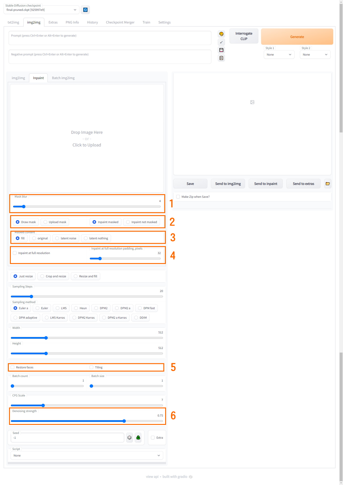

## 简介
　　`StableDiffusion` 是一个图像生成AI，只需要输入一段文本或关键词，`StableDiffusion` 就可以迅速将其转换为图像。也可以传入图片，配合文本或关键词对其进行处理。通过加载不同的模型，可使`StableDiffusion` 生成不同风格的图像。(ps: 本篇文章封面图就是用StableDiffusion 生成的)

## 安装
　　访问Github项目：[stable-diffusion-webui](https://github.com/AUTOMATIC1111/stable-diffusion-webui)，具体安装方法参考该项目文档

## 使用

1. 关键词，AI会根据Prompt 中的内容生成图片，首个关键词权重最高，往后依次递减
2. 负面关键词，AI会避免生成Negative prompt 中的内容，首个关键词权重最高，往后依次递减
3. 采样步数，步数越高细节越丰富，同时图片生成速度越慢，通常超过50后没有明显提升，为了平衡图片质量与出图速度，一般设置在20-50之间
4. 采样方法，通常使用`Euler a`，`Euler` 与`DDIM`
5. 分辨率，分辨率越高图片生成速度越慢，同时不同的分辨率会对构图产生明显的影响
6. 拟合程度，CFG越高 生成的图片与用户提供的关键词的拟合度越高，0代表完全不相关，一般设置在7-11之间
7. 生成种子，相同的种子在使用同样的参数的情况下会生成一样的图片

1. 控制蒙板边缘的模糊程度，数值越大，蒙板边缘越多的像素就会被纳入蒙板中
2. 控制如何输入蒙板以及如何修改图像，`Draw mask` 代表在网页上画出蒙板，`Upload mask` 代表上传已经绘制好的蒙板，`Inpaint masked` 代表修改蒙板覆盖的内容，`Inpaint not masked` 代表修改蒙板没有覆盖的内容
3. 控制如何修改图像，`fill` 代表覆盖重画, `original` 代表在原有内容上进行修改，`latent noise` 具体效果不明，但是AI会更倾向于在蒙板内新增内容，`latent nothing` 具体效果不明，但是AI会更倾向于涂抹掉蒙板内的内容
4. 控制修改时的分辨率，启用时会在重绘时将蒙板部分分辨率扩大到原图尺寸，完成后降回原本分辨率，有助于AI修改画面细节；后面的数值控制内边距
5. `Restore faces` 开启时AI会对面部进行更细致的描绘，但是会影响其他部分，建议只在修改面部时开启；`tiling` 开启后将启用CUDA的矩阵乘法优化，影响出图速度和显存消耗，但是会影响出图质量，不建议开启
6. `Denoise length` 代表对图像的扰动程度，0为最低，1为最高
    - `0.0-0.1`：一般用于超分辨率填充细节
    - `0.1-0.4`：一般用于微调细节
    - `0.4-0.6`：根据原图进行一定的调整，与用户的涂抹结果挂钩，涂抹越好AI生成结果越好，涂抹越抽象AI生成结果也越抽象
    - `0.6-0.9`：AI开始放飞自我，开始放弃对原图的参考
    - `0.9-1.0`：基本属于推倒重画，AI基本上不对原图进行参考

### 关键词特殊用法
- `()`: 强调符，会提升AI对该关键词的权重到原本的1.1倍，可叠加，`(())`会提升到1.1*1.1=1.21倍。
- `[]`: 弱化符，会降低AI对该关键词的权重到原本的1/1.1倍。
- `|`: 连接符，对同一个物品的描述可用该符号链接，以提高准确性，例：`white dress|long dress|sleeveless dress|strapless dress` 意为：白色无袖无肩带长连衣裙。
- `;`: 连接符，也可实现对同一个物品的描述，但是与`|`实现原理不同，例：`alloy;silver hair` 表现为：有金属光泽的银色头发。
- `\`: 转义符，将此符号后面的一个符号转义为普通字符。例：`hihaya \(clothing\)` 这个关键词中的`()`不会被AI视为强调符。
- `:`配合`()`可调整关键词权重，`(tag:1.2)`为提升到1.2倍，`(tag:0.95)`为降低到0.95倍。
- `:`与`::`配合`[]`可调整关键词的出场时机，`[tag:10]`意为在采样步数10步的时候开始进行绘制，`[tag::30]`意为在采样步数30步的时候停止进行绘制，配合使用可以达到混合的效果，例：`[window::5],[underwater:5]` 可形成通过窗户看见水下世界的画面效果。

<!--
## 相关网站
- NovelAI资源整合: https://www.kdocs.cn/l/cvg8ccOGj5sq
- 元素法典: https://docs.qq.com/doc/DWHl3am5Zb05QbGVs
- Danbooru Tag Wiki: https://danbooru.donmai.us/wiki_pages/tag_groups
-->
